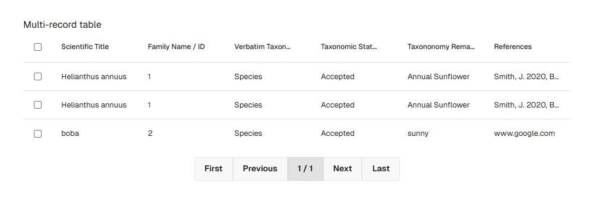
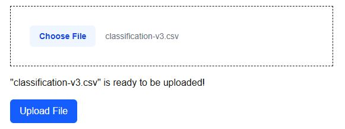

# Plant Inventory Application

## Table of Contents

- [Purpose](#purpose)
- [Overview](#overview)
- [Tech Stack & Dependencies](#tech-stack--dependencies)
- [Key Features](#key-features)
- [Current Status](#current-status)
- [Future Work](#future-work)

## Purpose

This project was built to solve the problem of efficiently managing and visualizing large-scale datasets (in this case, plant records) via a modern, full-stack web application. The goal is to demonstrate handling real-world CSV bulk uploads, robust backend processing, paginated REST API design, and scalable data presentation in the frontend.

## Overview

This application provides a scalable plant inventory dashboard designed to handle large datasets (1+ million rows). The core functionality allows users to upload CSV files containing plant data through a Next.js frontend using TypeScript, which are then securely sent to the backend for processing and eventual storage in a Microsoft SQL Server database.

The frontend presents a paginated, searchable table of plants retrieved from the backend via a parameterized REST API. Efficient pagination and API-driven data retrieval to ensure smooth performance with large datasets. The backend is built with ASP.NET Core 9.0, connected to a local MS SQL database via Entity Framework Core, incorporating API versioning.

## Tech Stack & Dependencies

### Frontend
- Next.js 15 (App Router, TypeScript)
- React 19
- axios (API requests)
- react-data-table-component (tabular data display)
- TailwindCSS 4, daisyUI
- TypeScript, ESLint, Turbopack

### Backend
- ASP.NET Core 9 (controller-based Web API)
- Entity Framework Core (with SQL Server)
- CsvHelper (CSV file reading/parsing)
- DotNetEnv (environment variable management)
- API Versioning: Asp.Versioning.Mvc, Asp.Versioning.Mvc.ApiExplorer
- Swashbuckle.AspNetCore (Swagger/OpenAPI docs)
- Microsoft.EntityFrameworkCore.SqlServer

### Database
- Microsoft SQL Server (local development)

### DevOps
- GitHub Actions (CI setup)
- Kestrel Server (configured for large uploads)
- Environment-based CORS policy (`http://localhost:3000` for development)

## Key Features

### Frontend

- **CSV File Upload:** Users can upload large CSV files (~360MB) through drag & drop or file selection on the dashboard.
- **Frontend Table Display:** Plant records are rendered in a responsive, paginated data table using React, axios, and react-data-table-component.
- **Styling & UI:** Uses TailwindCSS and daisyUI for clean, minimal UI components.
- **Dev Tooling:** TypeScript, ESLint, and Turbopack used for robust development experience.

### Backend
- **Controller-based ASP.NET Core Web API:** Backend is structured with controllers to expose API endpoints, integrating seamlessly with Entity Framework Core for data access and supporting scalable, maintainable REST architecture.
- **API Versioning:** Uses Asp.Versioning.Mvc packages for API versioning.
- **Backend File Processing:** CSV files are received and validated by the backend API (currently reading files with CsvHelper, with planned transformation and insertion into the database).
- **Paginated Data API:** Exposes a GET endpoint that supports parameterized pagination (page, pageSize) for efficient data requests.
- **Database Integration:** Local MS SQL Server database with EF Core managing data access, including conversion of enum properties to strings for storage.
- **CI/CD Pipeline:** Continuous Integration configured via GitHub Actions; Continuous Deployment workflow pending.

## Current Status

- Frontend supports CSV file uploads and displays paginated plant data fetched from the backend.
- Backend can receive large CSV files and read them, but data transformation and database insertion are yet to be implemented.
- Backend API fully supports paginated data retrieval integrated with the frontend.
- Large file upload size limits have been adjusted in the backend to handle the ~360MB dataset.

## Future Work

- Implement backend data validation, transformation, and database insertion for full CSV processing.
- Optimize for performance and scalability to handle datasets exceeding 1 million records.
- Expand frontend functionality with filtering, sorting, and advanced interaction features.
- Deploy backend and database to a cloud environment such as Azure for "production" readiness / testing.
- Set up full Continuous Deployment pipeline aligned with existing CI workflows.

